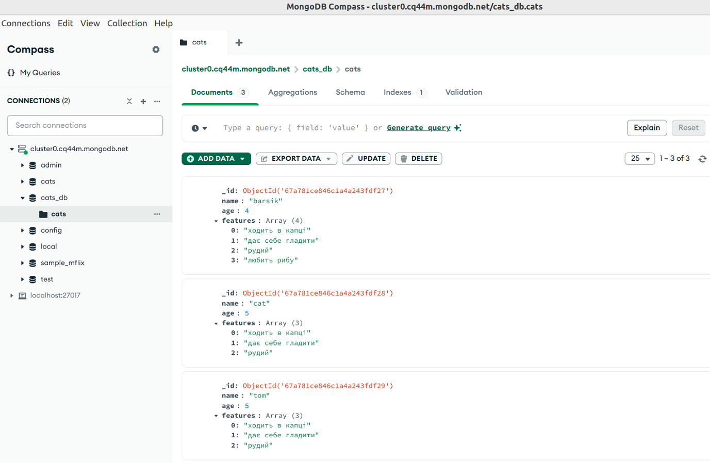

# goit-cs-hw-03

## Завдання 1

Створіть базу даних для системи управління завданнями, використовуючи PostgreSQL. База даних має містити таблиці для користувачів, статусів завдань і самих завдань. Виконайте необхідні запити в базі даних системи управління завданнями.

### Покрокова інструкція

1. Створіть таблиці у вашій PostgreSQL базі даних відповідно до вимог. Використовуйте належні типи даних та обмеження.

### Вимоги до структури бази даних:

#### Таблиця **users**:

**id**: Первинний ключ, автоінкремент (тип SERIAL),

**fullname**: Повне ім'я користувача (тип VARCHAR(100)),

**email**: Електронна адреса користувача, яка повинна бути унікальною (тип VARCHAR(100)).

#### Таблиця **status**:

**id**: Первинний ключ, автоінкремент (тип SERIAL),

**name**: Назва статусу (тип VARCHAR(50)), повинна бути унікальною. Пропонуємо наступні типи [('new',), ('in progress',), ('completed',)].

#### Таблиця **tasks**:

**id**: Первинний ключ, автоінкремент (тип SERIAL),

**title**: Назва завдання (тип VARCHAR(100)),

**description**: Опис завдання (тип TEXT),

**status_id**: Зовнішній ключ, що вказує на id у таблиці status (тип INTEGER),

**user_id**: Зовнішній ключ, що вказує на id у таблиці users (тип INTEGER).

2. Переконайтеся, що поля email у таблиці users та name у таблиці status є унікальними.

3. Налаштуйте зв'язки між таблицями таким чином, щоб при видаленні користувача автоматично видалялися всі його завдання (каскадне видалення).

4. Напишіть скрипт створення цих таблиць.

5. Напишіть скрипт seed.py на Python, який буде заповнювати ці таблиці випадковими значеннями. Використовуйте бібліотеку Faker.

6. Використовуючи SQL, виконайте наступні запити в базі даних системи управління завданнями.

### Запити для виконання:

Отримати всі завдання певного користувача. Використайте SELECT для отримання завдань конкретного користувача за його user_id.

Вибрати завдання за певним статусом. Використайте підзапит для вибору завдань з конкретним статусом, наприклад, 'new'.

Оновити статус конкретного завдання. Змініть статус конкретного завдання на 'in progress' або інший статус.

Отримати список користувачів, які не мають жодного завдання. Використайте комбінацію SELECT, WHERE NOT IN і підзапит.

Додати нове завдання для конкретного користувача. Використайте INSERT для додавання нового завдання.

Отримати всі завдання, які ще не завершено. Виберіть завдання, чий статус не є 'завершено'.

Видалити конкретне завдання. Використайте DELETE для видалення завдання за його id.

Знайти користувачів з певною електронною поштою. Використайте SELECT із умовою LIKE для фільтрації за електронною поштою.

Оновити ім'я користувача. Змініть ім'я користувача за допомогою UPDATE.

Отримати кількість завдань для кожного статусу. Використайте SELECT, COUNT, GROUP BY для групування завдань за статусами.

Отримати завдання, які призначені користувачам з певною доменною частиною електронної пошти. 

Використайте SELECT з умовою LIKE в поєднанні з JOIN, щоб вибрати завдання, призначені користувачам, чия електронна пошта містить певний домен (наприклад, '%@example.com').

Отримати список завдань, що не мають опису. Виберіть завдання, у яких відсутній опис.

Вибрати користувачів та їхні завдання, які є у статусі 'in progress'. Використайте INNER JOIN для отримання списку користувачів та їхніх завдань із певним статусом.

Отримати користувачів та кількість їхніх завдань. Використайте LEFT JOIN та GROUP BY для вибору користувачів та підрахунку їхніх завдань.

**Для запуску скрипту у терміналі:**
#### Для створення таблиць
```
python task_1.py
Таблиці успішно створені.
```
#### Для заповнення таблиць випадковими значеннями
```
python task_1_seed.py
База даних успішно заповнена випадковими даними.
```
#### Після створення і заповнення, база даних виглядає так:


#### Запити для виконання
```
python task_1_sample.py
Отримати всі завдання певного користувача: [(7, 'Room among.', None, 2, 1), (18, 'Somebody beautiful job carry.', 'Agreement half reduce she.\nRemain assume second weight move until. Would organization seek she see arrive.', 2, 1), (21, 'Нове завдання', 'Опис завдання', 1, 1)]

Вибрати завдання за певним статусом: [(4, 'Public them true set.', 'Democratic prevent letter else charge. Executive television yourself minute impact person heart.\nAgainst north nor the. Pressure need artist color.', 1, 5), (5, 'List close father.', None, 1, 8), (8, 'Cost skill there.', 'Young majority although shoulder give defense. Ready ahead value. Strategy go well.\nUnderstand bit leave why a material ago. Party history two Mr reduce allow.', 1, 3), (9, 'Figure audience hear ability.', None, 1, 5), (11, 'Energy audience trial indeed.', 'Few claim fine type. Close southern star. World imagine way each establish course bed.', 1, 5), (21, 'Нове завдання', 'Опис завдання', 1, 1)]

Отримати список користувачів, які не мають жодного завдання: [(9, 'Stephanie Fisher', 'smason@example.org'), (10, 'Stephanie Bush', 'jamesdavis@example.com')]

Отримати всі завдання, які ще не завершено: [(1, 'Compare start however interesting then.', 'Nothing south organization director discuss receive. Trial manager be then.\nWife for cut director. Standard together two chance marriage fact individual. Both think responsibility vote I.', 2, 7), (4, 'Public them true set.', 'Democratic prevent letter else charge. Executive television yourself minute impact person heart.\nAgainst north nor the. Pressure need artist color.', 1, 5), (5, 'List close father.', None, 1, 8), (6, 'Important listen.', 'Let wish want travel new. Dream population social per. South international ready son find election behind.\nEvidence character really grow weight. Involve there beyond.', 2, 5), (7, 'Room among.', None, 2, 1), (8, 'Cost skill there.', 'Young majority although shoulder give defense. Ready ahead value. Strategy go well.\nUnderstand bit leave why a material ago. Party history two Mr reduce allow.', 1, 3), (9, 'Figure audience hear ability.', None, 1, 5), (11, 'Energy audience trial indeed.', 'Few claim fine type. Close southern star. World imagine way each establish course bed.', 1, 5), (16, 'Human baby onto production seven.', 'Exist rate amount myself half wide involve. Decade measure model. Recently deep system lose all either.\nBut arrive vote still. Year to stay yet choice never can claim. Would one yourself itself.', 2, 2), (17, 'Fly war live serious.', 'Institution federal employee last very. Sit put figure model other.\nSomeone drive nice onto. Address old practice cover own get mention.', 2, 5), (18, 'Somebody beautiful job carry.', 'Agreement half reduce she.\nRemain assume second weight move until. Would organization seek she see arrive.', 2, 1), (19, 'Clear report former.', None, 2, 4), (20, 'Glass fish evidence.', None, 2, 3), (21, 'Нове завдання', 'Опис завдання', 1, 1), (2, 'Particularly modern leave trial.', 'If list than attack drug home.\nSimple attack culture stay able. Physical policy late involve conference. Method who radio surface.', 2, 4), (22, 'Нове завдання', 'Опис завдання', 1, 1)]

Знайти користувачів з певною електронною поштою: [(3, 'Kathryn Miranda', 'andreahill@example.com'), (8, 'Jonathan Harrington', 'osbornjodi@example.com'), (10, 'Stephanie Bush', 'jamesdavis@example.com')]

Отримати кількість завдань для кожного статусу: [('completed', 5), ('in progress', 9), ('new', 7)]

Отримати завдання, які призначені користувачам з певною доменною частиною електронної пошти: []

Отримати список завдань, що не мають опису: [(5, 'List close father.', None, 1, 8), (7, 'Room among.', None, 2, 1), (9, 'Figure audience hear ability.', None, 1, 5), (10, 'Same cut finally science.', None, 3, 5), (12, 'Pass floor high.', None, 3, 4), (13, 'Walk unit.', None, 3, 8), (14, 'If entire middle.', None, 3, 4), (19, 'Clear report former.', None, 2, 4), (20, 'Glass fish evidence.', None, 2, 3)]

Вибрати користувачів та їхні завдання, які є у статусі 'in progress': [(7, 'Nicole Mann', 'maryellis@example.net', 1, 'Compare start however interesting then.', 'Nothing south organization director discuss receive. Trial manager be then.\nWife for cut director. Standard together two chance marriage fact individual. Both think responsibility vote I.', 2, 7), (5, 'Dr. James Andrade', 'davidphillips@example.net', 6, 'Important listen.', 'Let wish want travel new. Dream population social per. South international ready son find election behind.\nEvidence character really grow weight. Involve there beyond.', 2, 5), (1, "Новий Ім'я", 'kcarlson@example.net', 7, 'Room among.', None, 2, 1), (2, 'Joann Thomas', 'mtaylor@example.org', 16, 'Human baby onto production seven.', 'Exist rate amount myself half wide involve. Decade measure model. Recently deep system lose all either.\nBut arrive vote still. Year to stay yet choice never can claim. Would one yourself itself.', 2, 2), (5, 'Dr. James Andrade', 'davidphillips@example.net', 17, 'Fly war live serious.', 'Institution federal employee last very. Sit put figure model other.\nSomeone drive nice onto. Address old practice cover own get mention.', 2, 5), (1, "Новий Ім'я", 'kcarlson@example.net', 18, 'Somebody beautiful job carry.', 'Agreement half reduce she.\nRemain assume second weight move until. Would organization seek she see arrive.', 2, 1), (4, 'Melissa Henry', 'xdurham@example.net', 19, 'Clear report former.', None, 2, 4), (3, 'Kathryn Miranda', 'andreahill@example.com', 20, 'Glass fish evidence.', None, 2, 3), (4, 'Melissa Henry', 'xdurham@example.net', 2, 'Particularly modern leave trial.', 'If list than attack drug home.\nSimple attack culture stay able. Physical policy late involve conference. Method who radio surface.', 2, 4)]

Отримати користувачів та кількість їхніх завдань: [('Stephanie Bush', 0), ('Stephanie Fisher', 0), ('Dr. James Andrade', 6), ('Kathryn Miranda', 2), ('Jonathan Harrington', 2), ("Новий Ім'я", 4), ('Melissa Henry', 4), ('Michael Branch', 1), ('Joann Thomas', 1), ('Nicole Mann', 1)]
```

## Завдання 2

Розробіть Python скрипт, який використовує бібліотеку PyMongo для реалізації основних CRUD (Create, Read, Update, Delete) операцій у MongoDB.

### Покрокова інструкція

1. Створіть базу даних відповідно до вимог.

Вимоги до структури документа

Кожен документ у вашій базі даних повинен мати наступну структуру:
```
{
    "_id": ObjectId("60d24b783733b1ae668d4a77"),
    "name": "barsik",
    "age": 3,
    "features": ["ходить в капці", "дає себе гладити", "рудий"]
}
```

Документ представляє інформацію про кота, його ім'я name, вік age та характеристики features.

2. Розробіть Python скрипт main.py для виконання наступних завдань.

### Завдання для виконання:

**Читання (Read)**
Реалізуйте функцію для виведення всіх записів із колекції.
Реалізуйте функцію, яка дозволяє користувачеві ввести ім'я кота та виводить інформацію про цього кота.

**Оновлення (Update)**
Створіть функцію, яка дозволяє користувачеві оновити вік кота за ім'ям.
Створіть функцію, яка дозволяє додати нову характеристику до списку features кота за ім'ям.

**Видалення (Delete)**
Реалізуйте функцію для видалення запису з колекції за ім'ям тварини.
Реалізуйте функцію для видалення всіх записів із колекції.

**Для запуску скрипту у терміналі:**
```
python task_2.py
Кіт barsik доданий до бази.
Кіт cat доданий до бази.
Кіт tom доданий до бази.
Всі коти наявні в базі:
{'_id': ObjectId('67a7809c32916786506e5cc9'), 'name': 'barsik', 'age': 3, 'features': ['ходить в капці', 'дає себе гладити', 'рудий']}
{'_id': ObjectId('67a7809d32916786506e5cca'), 'name': 'cat', 'age': 5, 'features': ['ходить в капці', 'дає себе гладити', 'рудий']}
{'_id': ObjectId('67a7809d32916786506e5ccb'), 'name': 'tom', 'age': 5, 'features': ['ходить в капці', 'дає себе гладити', 'рудий']}
Перший знайдений кіт з ім'ям barsik
{'_id': ObjectId('67a7809c32916786506e5cc9'), 'name': 'barsik', 'age': 3, 'features': ['ходить в капці', 'дає себе гладити', 'рудий']}
Всі знайдені коти з ім'ям barsik
{'_id': ObjectId('67a7809c32916786506e5cc9'), 'name': 'barsik', 'age': 3, 'features': ['ходить в капці', 'дає себе гладити', 'рудий']}
Вік кота barsik оновлено до 4 років.
До характеристик кота barsik додано: любить рибу.
Всі коти наявні в базі:
{'_id': ObjectId('67a7809c32916786506e5cc9'), 'name': 'barsik', 'age': 4, 'features': ['ходить в капці', 'дає себе гладити', 'рудий', 'любить рибу']}
{'_id': ObjectId('67a7809d32916786506e5cca'), 'name': 'cat', 'age': 5, 'features': ['ходить в капці', 'дає себе гладити', 'рудий']}
{'_id': ObjectId('67a7809d32916786506e5ccb'), 'name': 'tom', 'age': 5, 'features': ['ходить в капці', 'дає себе гладити', 'рудий']}
Кіт barsik видалений з бази.
Коти barsik не знайдені.
Всі коти наявні в базі:
{'_id': ObjectId('67a7809d32916786506e5cca'), 'name': 'cat', 'age': 5, 'features': ['ходить в капці', 'дає себе гладити', 'рудий']}
{'_id': ObjectId('67a7809d32916786506e5ccb'), 'name': 'tom', 'age': 5, 'features': ['ходить в капці', 'дає себе гладити', 'рудий']}
Всі коти видалені з бази.
```

### Перед видаленням всіх котів, база даних виглядає так:
